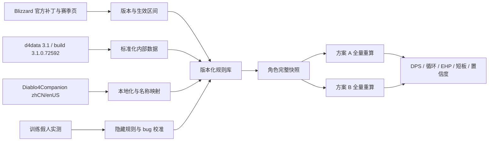

# 《暗黑破坏神 IV》S14 德鲁伊数据与精确顾问基础

> 数据时间切片：2026-07-13（Asia/Shanghai）
> 当前正式规则集：Season 14 / Season of Death Awakening / `3.1.0 Build #72592`
> PC 热修：`3.1.0c`（仅稳定性修复，不改变战斗数值）
> 待生效规则集：`3.1.1 Build #72805`，官方标注 2026-07-14，本文不将其计入当前值
> 顾问缓存有效期：截至 2026-07-13 23:59:59（Asia/Shanghai）；有效期内不为每次装备比较重复联网

## 1. 当前赛季与版本边界

Blizzard 官方赛季总览明确，最新正式赛季是第 14 赛季 **Season of Death Awakening**，于 2026-06-30 10:00 PDT 开始，即北京时间 2026-07-01 01:00。页面正文也明确使用“Season 14”。

- [Hunt the Death Cult in Season of Death Awakening](https://news.blizzard.com/en-us/article/24268702/hunt-the-death-cult-in-season-of-death-awakening)
- 页面发布时间：2026-06-23

对应的全平台当前战斗规则基线是 `3.1.0 Build #72592`，日期为 2026-06-30。

- [Diablo IV Patch Notes（3.1）](https://news.blizzard.com/en-us/article/24287406/diablo-iv-patch-notes)
- 页面发布时间：2026-06-23；这是持续更新页，应按补丁标题中的生效日期切片

Battle.net 和 Steam 截止 2026-07-13 还有 `3.1.0c` 热修，但只修复 Steam Deck 启动崩溃和游戏商城偶发崩溃，不改变战斗数据。该论坛帖作者的 Discourse 元数据标记为 Blizzard `staff=true`、`community-manager`。

- [HOTFIX 3 - July 10, 2026 - 3.1.0c](https://us.forums.blizzard.com/en/d4/t/hotfix-3-july-10-2026-310c/262200)

同一个官方补丁页已经提前列出 `3.1.1 Build #72805—July 14, 2026`。在本文时间切片中它尚未生效，因此以下内容必须标记为 `pending`，不能提前用于 7 月 13 日的装备比较：

- 德鲁伊切换类技能从 Storm Shepherd's Call Talisman 获得高于预期伤害的修复；
- Horadric Cube 的 Upgrade to Mythic 配方成本从 5 个 Pandemonium Fragments 降为 4 个；
- Mythic 掉落来源、Iconic Mythic 概率及其他 3.1.1 修复。

建议所有规则记录都带明确的生效状态与已核验时间：

```yaml
as_of: 2026-07-13T10:59:56+08:00
season:
  number: 14
  name: Season of Death Awakening
  effective_from: 2026-06-30T10:00:00-07:00
ruleset:
  version: 3.1.0
  build: 72592
  effective_from: 2026-06-30
  effective_until: null
  status: effective_as_of_cutoff
pc_hotfix:
  version: 3.1.0c
  effective_from: 2026-07-10
  combat_data_changed: false
pending:
  version: 3.1.1
  build: 72805
  official_date: 2026-07-14
  status: pending_as_of_cutoff
```

官方只公布了 3.1.1 的日期，没有公布具体部署时刻，因此不能把 `2026-07-14 10:00 PDT` 伪造成确定的 `effective_until`。顾问使用单独的缓存截止时间：到期后的第一次分析先核验规则集并生成新的版本锁；新版本锁有效期内继续复用，不在每次提问时重复联网。

## 2. 3.0 是当前德鲁伊不可缺少的前置基线

S14 不是在旧版德鲁伊上简单叠加 3.1 数字。2026-04-27 上线的 3.0 已重构全部职业技能树，任何 3.0 之前的完整技能、威能或构筑数据都不能直接视为当前状态。

- [Prepare for the Reckoning: Lord of Hatred Draws Near](https://news.blizzard.com/en-us/article/24267729/prepare-for-the-reckoning-lord-of-hatred-draws-near)，发布于 2026-04-23
- [Diablo IV Patch Notes (3.0)](https://news.blizzard.com/en-us/article/24271857/diablo-iv-patch-notes-3-0)，发布于 2026-04-23

官方确认的当前结构包括：

- 所有职业技能树重新设计，主动技能有三层逐步开放的分支；
- 被动节点移出技能树，部分旧传奇威能移入技能树成为 Bonus Skill Variants；
- 多数德鲁伊技能可通过不消耗技能点的选择节点指定 Human、Werewolf 或 Werebear 施放形态；
- Companion、Earthen Bulwark、Cyclone Armor、Hurricane 不改变当前形态；
- Storm 技能通常可选 Human/Werewolf，Earth 技能通常可选 Human/Werebear；
- 技能形态和标签会继续参与装备词缀、威能、巅峰、护符 Seal/Charm 的条件判断；
- Unique 与 Mythic 可 Temper，超过 200 个传奇威能在 3.0 被重做；
- 3.0.2 又修改了 Storm Shepherd 和 Mark of the Old Wolf 的叠加与乘区行为，因此必须在 3.0 初始规则之上按补丁顺序覆盖。

## 3. 3.1.0 当前有效的德鲁伊重点改动

以下均来自当前 [3.1 官方补丁页](https://news.blizzard.com/en-us/article/24287406/diablo-iv-patch-notes)，需要覆盖在 3.0 最终状态之上。

### 3.1 灵物恩惠、威能与传奇节点

- Scythe Talons：暴击率 `5%[+] → 10%[+]`；
- Powershifting Aspect：增伤 `10–13.8%[x] → 10–15%[x]`；
- Archdruid's Aspect：各项数值统一并提高至 `45–60%[x]`；
- Survival Instincts：熊人形态下造成 `45%[x]` 伤害，并按自身与敌人当前生命百分比、强固生命百分比的差额额外获得最高 `25%[x]`；
- Shepherd's Aspect：`5–13%[x] → 2–3%[x]`；
- Constricting Tendrils Legendary Node：`40%[x] → 60%[x]`。

### 3.2 巅峰雕文

- Fang and Claw Glyph：`12% → 15%[x]`；
- Fulminate Glyph：对 Healthy 与 Injured 的伤害 `12%[x] → 35%[x]`；
- Spirit Glyph：`15%[x] → 12%[x]`。

### 3.3 护符套装

- Might of the Den Mother 2 件效果：`2% → 3%`；
- Storm Shepherd 2 件效果：`40% → 60%`；
- Storm Shepherd 5 件效果：双重/三重施放增伤由 `100%/300% → 500%`。

### 3.4 独特装备

- Dolmen Stone：爆炸改为 Boulder 伤害的 `75–90%[x]`；
- Greatstaff of the Crone：`30–40%[x] → 60–80%[x]`；
- Hunter's Zenith：`40–60%[x] → 75–90%[x]`；
- Mjölnic Ring：`30–40%[x] → 45–60%[x]`；
- The Basilisk：石化敌人额外承受 `60–90%[x]` 伤害；
- Waxing Gibbous：增伤 `20–25%[x] → 45–60%[x]`，额外攻击概率 `25% → 33%`。

3.1 补丁页还逐项列出了所有德鲁伊 Unique 的两个保证词缀，可作为 S14 Unique 保证字段的官方来源。3.1.0 同时规定：

- 所有 Unique 掉落时都有两个保证词缀；
- Unique、Mythic Unique、Iconic Mythic 可在附魔师重洗一个词缀；
- 通过 Enchanting、Transfiguration、Tempering 加到 Mythic 上的词缀固定为满值；
- Upgrade to Mythic 返回同一装备槽位；
- Mythic Unique 总是 Ancestral，Unique Power 提高 30%，其他词缀取最大值。

## 4. 官方公开的伤害计算规则及覆盖关系

[Blizzard 官方伤害桶说明](https://news.blizzard.com/en-us/article/24014289/master-your-power-in-season-of-blood)明确：

- 暴击具有基础 `50%[x]` 乘区；
- 易伤具有基础 `20%[x]` 乘区；
- 额外暴击、易伤、压制伤害通常与其他加法增伤相加；
- 官方给出的组合形式为：

```text
(1 + additive_bonus)
× (1 + multiplicative_source_1)
× (1 + multiplicative_source_2)
× ...
```

压制规则后来被 [2.3.0 官方补丁](https://news.blizzard.com/en-us/article/24215995/diablo-iv-patch-notes-2-3)覆盖：基于生命和强固的固有加法压制伤害已移除，压制现在只保留最高 `50%[x]` 的基础增伤。旧资料中把生命、额外生命和强固加入压制伤害的公式已失效。

官方公开的是规则片段和补丁差分，而不是完整的 S14 闭式公式。因此不能只靠这些页面推导所有技能的最终命中值。

## 5. 数据源分层

### 5.1 Blizzard 官方源：版本真值与规则语义

用途：

- 确认赛季、补丁、构筑号、生效日期和平台范围；
- 确认 `[+]` 与 `[x]`、技能标签、条件和补丁覆盖关系；
- 识别已知 bug、未来修复和设计意图。

限制：

- 没有公开 S14 完整、版本化的技能/威能/词缀/巅峰机器可读数据库或 Diablo IV 官方 API；
- 补丁页大多只给旧值到新值的差分，不提供完整当前快照；
- 没有公开所有触发顺序、快照、舍入、攻速断点、敌人防御和 Boss 特殊减伤公式。

### 5.2 DiabloTools/d4data：游戏文件解析层

使用 [`DiabloTools/d4data` 的 3.1 分支](https://github.com/DiabloTools/d4data/tree/3.1)，并强制核对该分支的 [`buildVersion.txt`](https://raw.githubusercontent.com/DiabloTools/d4data/3.1/buildVersion.txt)：

```text
buildVersion = 3.1.0.72592
```

其 [README](https://github.com/DiabloTools/d4data/blob/3.1/readme.md) 声明数据直接从游戏文件解析，可作为当前技能、装备、词缀、威能、巅峰等结构化原始数据的主要技术来源。导入时必须保存：

- 仓库、分支、commit SHA、生成时间；
- `buildVersion`；
- 原始记录 ID、内部名称、数值表达式和本地化键；
- 与官方补丁差分的核对结果。

不同 buildVersion 的产物不得合并为同一个无版本数据集。

### 5.3 josdemmers/Diablo4Companion：本地化与消费层

[`josdemmers/Diablo4Companion`](https://github.com/josdemmers/Diablo4Companion) 提供 `zhCN`/`enUS` 的以下数据：

- Aspects；
- Uniques；
- Affixes；
- ParagonBoards；
- Glyphs。

该项目基于 d4data，适合提供中文展示、名称映射和面向顾问的标准化对象，但不应被视为独立于 d4data 的第二份底层真值。必须同时记录它所依赖的 d4data 版本，并通过稳定内部 ID 连接中英文名称，不能只按显示文本匹配。

### 5.4 实测校准层

对客户端数据和补丁文字仍不能确定的行为，使用训练假人进行控制变量实验，记录：

- 客户端完整版本和平台；
- 全部装备、技能、巅峰与临时增益；
- 目标类型、距离、生命状态、是否易伤/控制/石化；
- 样本量、最小/最大/均值、暴击与非暴击分布；
- 是否存在服务器热修或已知异常。

实测结论不得覆盖原始数据，应作为带置信区间的规则补丁单独存储。

## 6. 精确装备顾问的输入模型

一次可复算的角色快照必须覆盖以下信息。

### 6.1 装备

每个槽位完整记录：

- 装备类型、物品强度、普通/Ancestral/Unique/Mythic/Iconic 品质；
- 固有词缀、全部显式词缀及实际数值；
- Greater Affix（GA）标记；
- Masterworking 等级及每次强化命中的词缀；
- Tempering 配方、词缀、数值和剩余重铸信息；
- Legendary Aspect/Unique Power 的实际 roll、槽位倍率及是否启用；
- 宝石、符文、镶孔和 Talisman Seal/Charm；
- 附魔、Transfiguration、Horadric Cube 改造和 crafted Mythic 限制；
- 两件待比较物品必须保留所有字段，不能只输入面板攻击力变化。

### 6.2 构筑

- 主动技能等级、三个分支选择、Bonus Skill Variant 和每个技能的当前标签/施放形态；
- 被动来源及技能等级增益；
- Spirit Boons 与绑定选择；
- Paragon Boards、旋转方向、全部已购节点、Legendary Nodes；
- Glyph、等级、插槽、范围内有效属性及额外条件是否满足；
- Talisman 套装、Seals、Charms；
- Runewords；
- Mercenary 主动/被动选择及 Reinforcement；
- 季节祝福和其他会影响战斗的赛季系统。

### 6.3 角色面板与目标场景

- 主属性、生命、强固、护甲、全抗和单抗；
- 暴击率、攻速、幸运一击、资源上限、生成、恢复、减耗、冷却；
- 全部加法伤害分类和面板可见乘区；
- 输入快照与游戏面板差值，用于发现漏项或城镇面板不生效问题；
- 目标场景：清图、单体 Boss、Tower/Pit 层级、目标距离、是否 Healthy/Injured、易伤覆盖、控制/石化覆盖、战斗时长和移动损失；
- 输出目标：爆发、持续 DPS、有效生命、资源稳定性或综合评分。

## 7. 计算引擎

### 7.1 事件化伤害模型

不要把所有伤害压缩成一个“攻击力”数字。每个伤害事件至少区分：

- 直接命中；
- Damage over Time；
- 压制；
- 暴击；
- 易伤；
- Lucky Hit；
- Companion/召唤物；
- 触发技能、额外投射物、额外施放和 Talisman 套装事件。

每个事件按自身标签、条件、技能系数、加法池和独立乘区计算。暴击、易伤、压制、额外施放和状态覆盖用概率或时间覆盖率进入期望值，不能默认 100%。DoT 应独立处理是否能暴击、tick 频率、叠加/刷新和持续时间。

### 7.2 攻速、资源与循环

持续 DPS 必须基于技能循环模拟，而不是单次伤害：

- 按技能类别使用正确攻速档位和断点；
- 计算资源生成、消耗、减耗、返还和空窗；
- 计算冷却、重置、额外充能、动画时间和移动占比；
- 计算易伤、控制、石化、形态和各类增益的真实覆盖率；
- 同时输出稳态 DPS、短时间爆发和资源枯竭时间。

### 7.3 韧性

韧性至少拆分为：

- 生命、强固、Barrier；
- 护甲对应的物理减伤；
- 各元素抗性；
- 通用和条件 Damage Reduction；
- Dodge、Block、免疫、Unstoppable；
- 治疗、吸收、回复和技能可用率。

用指定敌人伤害构成计算有效生命（EHP）和危险窗口，不能把不同减伤简单相加。

### 7.4 A/B 全量重算

比较两件装备时，分别生成完整角色状态 `A` 和 `B`，从头执行：

1. 解析装备和构筑；
2. 重建技能标签、形态、词缀和套装激活状态；
3. 重算面板、伤害事件、资源循环和韧性；
4. 在相同场景、相同随机假设下模拟；
5. 输出差值及其来源分解。

禁止只用“新词缀减旧词缀”的局部评分，因为换装可能同时改变威能槽位倍率、技能等级、攻速档位、资源循环、巅峰条件、抗性上限和套装激活。

建议结果至少包含：

```text
单体持续 DPS：A / B / 差值%
清图有效 DPS：A / B / 差值%
爆发窗口：A / B / 差值%
资源净变化与空窗率
物理/元素 EHP
护甲、抗性、移动、资源或冷却短板
结论成立的场景与置信度
```

## 8. 不确定性、bug 与置信度

每条规则需要来源和置信度：

| 等级 | 含义 | 处理方式 |
| --- | --- | --- |
| A | 当前版本游戏文件与官方补丁一致 | 直接用于计算 |
| B | 游戏文件明确，官方未逐项说明 | 使用并保留内部 ID、表达式和 commit |
| C | 社区实现或训练假人稳定实测 | 使用实测参数和置信区间 |
| D | 隐藏公式、样本不足或已知 bug | 给范围，不声称精确值 |

3.1.1 已确认 Storm Shepherd's Call 在 3.1.0 会令德鲁伊切换类技能偶尔获得高于预期伤害，但官方没有公布错误倍率。因此 7 月 13 日存在两个需要并行输出的模型：

- `intended_model`：按 tooltip、d4data 和官方设计值计算；
- `observed_live_model`：仅在训练假人校准后纳入 3.1.0 bug，并标记平台、客户端版本、触发条件和误差。

若没有足够实测，顾问必须明确写“该部分无法从官方资料精确量化”，不能用猜测补齐。

## 9. 推荐的数据更新流水线



每次客户端更新应自动执行：

1. 检测官方补丁和生效时间；
2. 校验 d4data 的 `buildVersion` 与 commit；
3. 生成新旧快照 diff；
4. 对照官方补丁逐条审计异常差异；
5. 更新中英文名称映射；
6. 运行固定构筑回归测试和训练假人校准集；
7. 新规则集通过验证后才切换为 `effective`。

## 10. 当前可达的准确性结论

以 `3.1.0.72592` 的游戏文件解析数据为底层快照、Blizzard 官方补丁为版本和语义真值、Diablo4Companion 为中英文消费层，再对隐藏公式与已知 bug 做训练假人校准，可以构建远比静态“装备评分”可靠的德鲁伊顾问。

但“精确”必须定义为：在声明的客户端版本、构筑快照、目标场景、随机期望和已校准规则下可重复计算。对官方未公开或仍有 bug 的机制，应输出误差范围与置信度，不能给出虚假的单点精确答案。

## 11. 顾问版本缓存与过期规则

顾问不在每次装备比较前重复搜索赛季和补丁。每个已核验规则集保存一份版本锁，在 `cache_valid_through` 之前直接复用。当前锁为：

```yaml
version_lock:
  season: 14
  ruleset: 3.1.0.72592
  platform_scope: all
  checked_at: 2026-07-13T10:59:56+08:00
  cache_valid_through: 2026-07-13T23:59:59+08:00
  next_known_change:
    ruleset: 3.1.1.72805
    official_date: 2026-07-14
    exact_release_time_known: false
```

处理规则：

1. 当前时间没有超过缓存截止时间时，装备比较直接使用锁定规则集，不联网刷新；
2. 到期后的第一份分析先核验官方补丁页、官方热修和客户端/数据文件 build，再生成新的版本锁；
3. 刷新成功后，后续分析继续复用新锁，直到它再次过期；
4. 若用户截图中的客户端版本与锁定 build 不一致，立即使缓存失效；
5. 若已知存在服务器热修、平台专属热修或数值修订，即使客户端 build 不变，也使对应平台缓存失效；
6. 新规则上线后，Storm Shepherd、形态切换、伤害乘区和固定构筑回归集必须重新验证。

必须刷新规则库的事件包括：新 build 或 hotfix、3.1.1 实际生效、新赛季、技能/威能/暗金/巅峰/护符/词缀/精铸系统改动，以及不同平台规则发生分叉。普通的装备截图比较不是刷新触发器。

## 12. 固定构筑基线

装备顾问的默认构筑固定为：

- D2Core：[`bd=1ZsP&var=9`](https://www.d2core.com/d4/planner?bd=1ZsP&var=9)
- 构筑标题：`【蓝萌君】S14德子 风暴狼德 - 全版本`
- 固定变体：`利爪 - 冲层版本`
- 页面快照日期：2026-07-13
- 页面显示最近更新：2026-07-09

用户声明会完全照抄该变体的技能、技能分支、灵物恩惠、威能、暗金、巅峰盘、雕文、符文、佣兵和护符套装。因此默认比较规则是：

1. 除待比较装备所在槽位外，其余构筑字段保持该链接当前快照不变；
2. 用户人物截图中的实际装备数值、GA、精铸、回火、宝石和改造覆盖规划器的理想数值；
3. 若候选装备会改变威能、暗金能力、技能等级、套装件数或触发条件，方案 A/B 都从完整角色状态重新构建；
4. 不要求用户每次重复发送 D2Core 链接；只有用户明确换构筑、换变体，或链接内容在新版本下失效时才重新抓取；
5. 固定构筑本身也带快照日期。若 D2Core 作者后来修改同一链接，旧计算仍引用本地快照，除非用户要求采用新版。

该基线当前可识别的固定结构包括：83/83 技能点；五块巅峰盘、四个传奇节点、五个 150 级雕文；灵物恩惠为 Prickleskin、Avian Wrath、Calamity、Calm Before the Storm 与 Overcharge；技能栏为 Wolves、Debilitating Roar、Hurricane、Grizzly Rage、Lightning Storm、Shred，并由构筑触发 Cyclone Armor、Earthen Bulwark 和 Blood Howl。

固定装备/能力槽位如下。表中只锁定物品或能力身份，不把规划器的理想 GA、精铸和回火数值当成用户实装；这些数值由人物和装备截图覆盖。

| 槽位 | 固定物品或能力 | 固定机制 |
| --- | --- | --- |
| 头盔 | 加斯伦的天命 | 自动施放 Cyclone Armor，并提供其被动减伤 |
| 胸甲 | 衰弱毒素之威能 | 通用减伤，并降低中毒敌人造成的伤害 |
| 手套 | 黑暗嚎叫 | Debilitating Roar 转为狼人技能，吼叫期间提高狼形态伤害 |
| 裤子 | 迪博特的意志 | 不可阻挡及其后续窗口增伤并回复主要资源 |
| 靴子 | 剥削者的威能 | 对不可阻挡敌人的独立增伤；生存不足时页面建议改用生存方案 |
| 项链 | 凶邪新月 | 狼人形态自动触发 Blood Howl，并在触发后获得增伤 |
| 项链改造 | 超载威能 | 风暴技能施加易伤，并对易伤敌人增伤 |
| 戒指 1 | 艾蕊达哀歌 | 风暴技能回灵，并对易伤/定身/减速目标强化增伤 |
| 戒指 2 | 大德鲁伊的威能 | 按人形、狼形暴击及带 Resolve 的熊形条件提供独立倍率 |
| 主手 | 盈月当空 | 提高 Shred 伤害，并以 33% 概率连续追加攻击，最多追加四次 |
| 副手 | 伊菲的恐狼图腾 | Grizzly Rage 改为狼人形态并提高暴击/毒素伤害 |

固定技能点与分支快照：

| 技能 | 等级 | 关键分支/形态 |
| --- | ---: | --- |
| Debilitating Roar | 8/15 | 范围、持续时间、冷却、Werebear |
| Lightning Storm | 1/15 | Hero of the Storm、Additional Strikes、Werewolf |
| Grizzly Rage | 15/15 | Cornered Beast、冷却、强固、Werebear |
| Wolves | 1/15 | Thrill of the Hunt、攻速、Versatile |
| Cyclone Armor | 15/15 | Reversal、范围、抗性、Versatile |
| Shred | 15/15 | Storm Shred、治疗、施放速度、Werewolf |
| Hurricane | 1/15 | Derecho、Weaken、Versatile |
| Earthen Bulwark | 2/15 | Travertine、强固/治疗、Unstoppable、Versatile |
| Blood Howl | 1/15 | Spirit Howl、治疗、Unstoppable、Werewolf |

固定巅峰盘为 Start、Thunderstruck、Lust for Carnage、Constricting Tendrils、Ancestral Guidance；使用四个非起始盘传奇节点与五个 150 级雕文。符文快照为 Per + Que 触发 Earthen Bulwark，以及 Moni + 图触发 Frost Nova。页面冲层说明以山脉套装 5 件与 Storm Shepherd 3 件为主方案，并将另一种件数组合作为需要实测的对照方案。

当前规划器只精确分配了 298 个巅峰点，并把剩余 44 点概括为投入意力。凡是这 44 点会影响装备比较、雕文范围、稀有节点奖励或生存结论时，顾问必须使用用户的实际巅峰截图覆盖这一不确定项。

## 13. 两件装备截图的决策协议

收到两张候选装备截图后，先提取物品强度、基础伤害/护甲、全部词缀、GA、精铸命中、回火、威能或暗金能力、宝石/符文和改造信息。然后按以下规则处理。

### 13.1 可以独立得出结论时

满足下列条件时直接全量重算并给出结论，不要求用户补充面板：

- 截图清晰且所有变化字段完整；
- 固定构筑已经确定其他乘区和触发条件；
- 两方案不会落在未知的暴击率、攻速、护甲、抗性、资源或冷却断点两侧；
- 缺失输入造成的最坏误差仍不足以改变胜负；
- 伤害优势和生存代价没有形成无法判断的交叉结果。

此时报告至少输出：单次伤害期望、持续 DPS、差值与百分比、资源/冷却变化、物理与元素 EHP 变化、魔渊适用结论及置信度。

### 13.2 必须请求补充信息时

只有下列信息可能改变结论时才请求用户补充对应截图，不重复索要已经保存的内容：

- 暴击率接近 100%，无法判断新暴击词条是否溢出；
- 攻速变化可能跨越利爪动画档位；
- 冷却变化可能改变灰熊狂怒或关键防御技能覆盖；
- 资源生成、上限或减耗可能导致利爪/Storm Shepherd 循环断档；
- 护甲或某项抗性接近当前目标怪物等级下的上限；
- 最大生命、强固、屏障或条件减伤缺失，无法判断高层致死风险；
- 截图裁切、模糊，或某个 GA、精铸、回火/改造来源无法识别；
- 实际 342 点巅峰落位与规划器的 298 点模板不同，并且差异影响比较。

补充请求必须具体，例如“请补一张战斗状态下暴击率、攻速和资源生成页”，不能笼统要求重新提交全部人物资料。

若缺失信息只影响数值精度、不影响胜负，则直接给结论，并同时给出上下界和缺失项可能造成的最大偏差。

## 14. 无预设目标层数的魔渊预测

用户不需要预先指定魔渊层数。信息足够时，顾问反向计算当前角色的期望层数，输出三个结果：

```text
伤害上限层：在首领限时内，期望伤害足以完成的最高层
生存上限层：在约定失误模型下，致死风险仍可接受的最高层
综合期望层：min(伤害上限层, 生存上限层)
```

伤害上限使用当前规则集的怪物生命缩放、首领战时间、实际持续 DPS、移动损失和机制免疫阶段计算。生存上限使用对应层级敌人的物理/元素伤害、角色 EHP、强固/屏障/治疗覆盖、关键防御空窗和高危词缀计算。

层数预测应输出区间而不是伪造单点保证值，例如：

```text
稳定期望：142–145
高操作上限：147–149
主要瓶颈：首领阶段伤害
下一层提升优先级：易伤倍率 > 冷却覆盖 > 最大生命
```

若当前版本没有可靠的怪物生命/伤害缩放或缺少实战校准，顾问只能输出带置信区间的估算，并明确列出模型误差。D2Core 作者的 150 层记录可作为固定构筑的外部上限参考，但不能直接当作用户角色的预测层数；用户的实际词条、操作覆盖率和生存数据必须进入模型。

当伤害与生存的结论冲突时，默认优化目标不是训练假人最高 DPS，而是提高 `综合期望层`。只有在生存仍高于伤害上限所需阈值时，才选择纯伤害更高的装备。

## 15. 本地角色同步与截图识别实现

工作区内的可执行实现位于 `src/d4advisor/`，数据按职责分为：

- `data/reference/version-lock.json`：当前赛季/补丁缓存及过期条件；
- `data/reference/fixed-build.json`：锁定的 D2Core 构筑快照；
- `data/reference/stat-definitions.json`：中英文词条与标准内部字段映射；
- `data/reference/calculation-rules.json`：已经确认的常用公式与限制；
- `data/user/current.json`：用户当前角色状态；
- `data/user/history/`：每次角色变更后的不可变历史快照；
- `data/user/candidates/`：OCR 已识别但尚未确认穿戴的候选装备。

装备截图使用本地 RapidOCR/ONNX Runtime 识别，不上传图片。识别流程自动过滤装备面板外的背景数字，保存每行原文和置信度，并通过词条左侧图标区域识别 Greater Affix 标记。无法识别或置信度不足的字段进入 `review`，不会静默覆盖角色数据。

角色数据采用原子写入：先生成临时 JSON，再替换 `current.json`，最后保存带时间和内容摘要的历史快照。候选装备只有在用户确认穿戴槽位后才通过 `profile set-item` 合并，避免把单纯用于比较的截图错误地当作当前装备。
